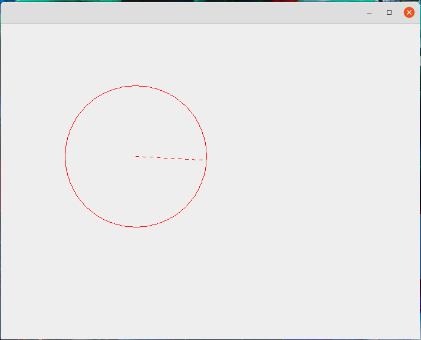
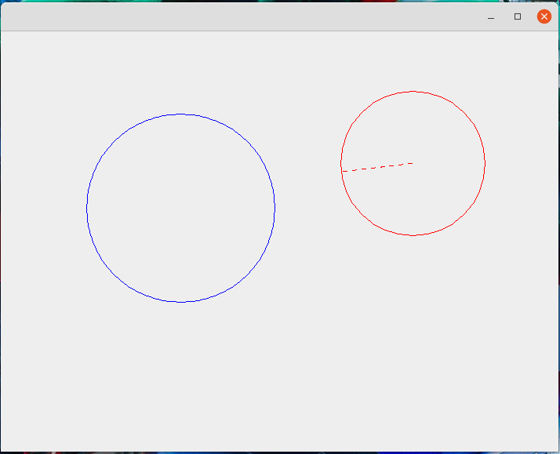
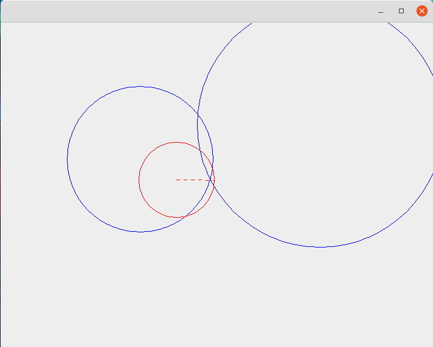

# Draw-Circle-Java

> The program generates circle by registring the centre of circle on first mouse click and registring the radius at second mouse click.





## Running Program

OS X & Linux terminal:

```sh
javac *.java
java ShapeViewer
```

Windows cmd:

```sh
javac Circle.java drawCircles.java drawCircleTester.java Point.java
java ShapeViewer
```
